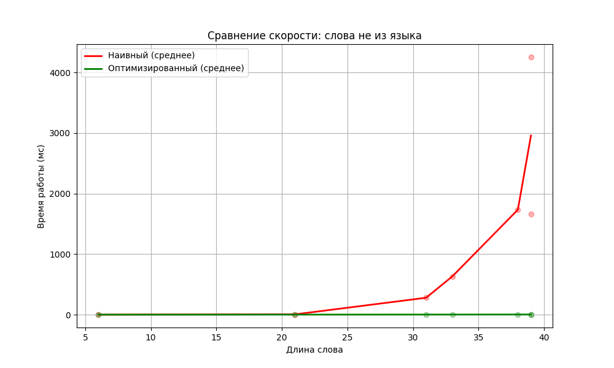
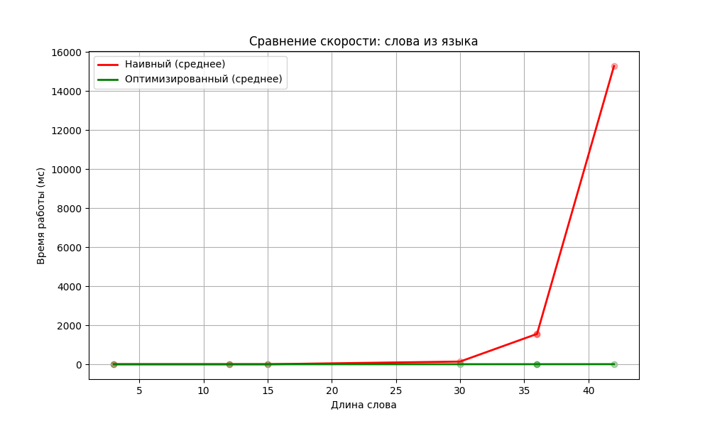

# Лабораторная работа №4. Вариант 17

## Грамматика

S → T a S S a T S₁.v == S₂.v, S₀.v := min(T₁.v, T₂.v)  
T → T a T T₀.v := T₁.v + T₂.v  
T → b b T.v := 1  
S → aba S.v := 1  
S → b b S S₀.v := 0  

## 1. Исходная грамматика эквивалентна следующей

S → b b S S₀.v := 0  
S → aba S.v := 1  

S → (bba)ⁿ S S a (abb)ᵐ S₁.v == S₂.v, S₀.v := min(n, m), n, m > 0  

Заменим для удобства bba = A, abb = B, aba = C и рассмотрим слово  

A (A)^(p!) C C (B)^p (A)^(p!) C C (B)^p B  

Тогда по лемме Огдена, если мы выделим первый блок (B)^p, то для любого разбиения первый блок (B)^p при накачке будет увеличиваться длина, но не будет увеличиваться второй блок (B)^p, значит нарушится условие S₁.v == S₂.v и слово выпадет из языка. Тогда язык – не КС.  

## 2. Наивный парсер

Наивный парсер построен рекурсивно, перебирая в лоб все возможные варианты разбора слова.  

## 3. Оптимизированный парсер

Оптимизированный парсер построен перебором циклами и использует тот факт, что aba в слове – это всегда конец какого-то S. Его сложность – O(n⁶), где n – длина слова.  

## 4. Графики скорости работы парсеров

- на батче слов не из языка:  
    

- на батче слов из языка:  
    
