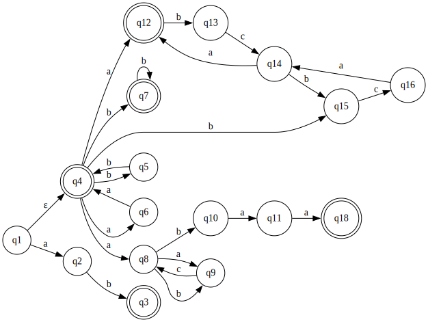
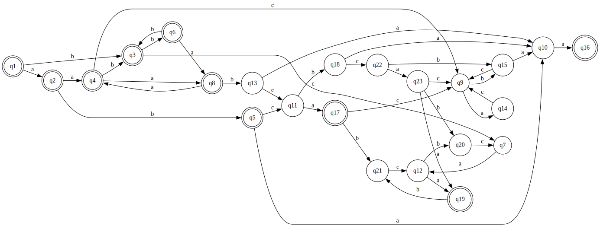
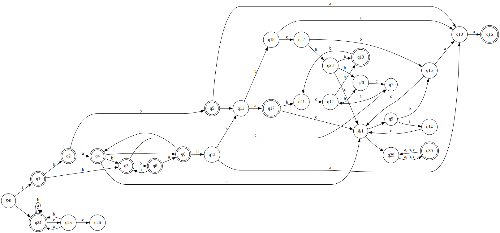

# Лабораторная работа №2

**Исходное регулярное выражение (вариант 17):**

```
((aa|bb)*)(b*|(a|a((bc|ac)*b)a|(abc|bca)*)a)|ab
```

---

## 1. НКА



**Таблица:**

| state | caa | bca |  b | abca |  a | ca | aa | baa |  ε |
| ----- | --: | --: | -: | ---: | -: | -: | -: | --: | -: |
| b     |   1 |   0 |  1 |    0 |  0 |  0 |  0 |   1 |  1 |
| a     |   0 |   1 |  1 |    0 |  1 |  0 |  1 |   1 |  1 |
| ε     |   0 |   0 |  1 |    1 |  1 |  0 |  1 |   0 |  1 |
| abc   |   0 |   0 |  0 |    1 |  1 |  0 |  0 |   1 |  0 |
| aba   |   0 |   0 |  0 |    0 |  1 |  0 |  0 |   0 |  0 |
| ab    |   0 |   0 |  0 |    0 |  0 |  1 |  1 |   0 |  1 |
| bc    |   0 |   0 |  0 |    0 |  0 |  0 |  1 |   0 |  0 |
| aac   |   0 |   0 |  0 |    0 |  0 |  0 |  0 |   1 |  0 |
| abaa  |   0 |   0 |  0 |    0 |  0 |  0 |  0 |   0 |  1 |

---

## 2. Минимальный ДКА



**Таблица:**

| state  |  ε |  a |  b | aa | ab | ba | bb | ca | aaa | aab | abb | baa | bca | caa | abca | cbaa | aabca | acbaa |
| ------ | -: | -: | -: | -: | -: | -: | -: | -: | --: | --: | --: | --: | --: | --: | ---: | ---: | ----: | ----: |
| ε      |  1 |  1 |  1 |  1 |  1 |  0 |  1 |  0 |   1 |   1 |   0 |   0 |   0 |   0 |    1 |    0 |     0 |     0 |
| a      |  1 |  1 |  1 |  1 |  1 |  0 |  0 |  0 |   1 |   0 |   1 |   1 |   1 |   0 |    0 |    0 |     1 |     1 |
| b      |  1 |  0 |  1 |  0 |  0 |  1 |  1 |  0 |   0 |   0 |   0 |   1 |   0 |   1 |    0 |    0 |     0 |     0 |
| aa     |  1 |  1 |  1 |  1 |  0 |  0 |  1 |  0 |   1 |   1 |   0 |   0 |   0 |   0 |    1 |    1 |     0 |     0 |
| ab     |  1 |  0 |  0 |  1 |  0 |  0 |  0 |  1 |   0 |   0 |   0 |   0 |   0 |   0 |    0 |    1 |     0 |     0 |
| bb     |  1 |  1 |  1 |  1 |  0 |  0 |  1 |  0 |   1 |   1 |   0 |   0 |   0 |   0 |    1 |    0 |     0 |     0 |
| bc     |  0 |  0 |  0 |  1 |  0 |  0 |  0 |  0 |   0 |   0 |   0 |   0 |   0 |   0 |    0 |    0 |     1 |     0 |
| aaa    |  1 |  1 |  0 |  1 |  1 |  0 |  0 |  0 |   1 |   0 |   1 |   1 |   1 |   0 |    0 |    0 |     1 |     1 |
| aac    |  0 |  0 |  0 |  0 |  0 |  0 |  0 |  0 |   0 |   0 |   0 |   1 |   0 |   0 |    0 |    0 |     0 |     1 |
| aba    |  0 |  1 |  0 |  0 |  0 |  0 |  0 |  0 |   0 |   0 |   0 |   0 |   0 |   0 |    0 |    0 |     0 |     0 |
| abc    |  0 |  1 |  0 |  0 |  0 |  0 |  0 |  0 |   0 |   0 |   0 |   1 |   0 |   0 |    1 |    0 |     0 |     1 |
| bca    |  0 |  1 |  0 |  0 |  0 |  0 |  0 |  0 |   0 |   0 |   0 |   0 |   0 |   0 |    1 |    0 |     0 |     0 |
| aaab   |  0 |  0 |  0 |  1 |  0 |  0 |  0 |  1 |   0 |   0 |   0 |   0 |   0 |   0 |    0 |    1 |     0 |     0 |
| aaca   |  0 |  0 |  0 |  0 |  0 |  0 |  0 |  0 |   0 |   0 |   0 |   0 |   0 |   0 |    0 |    1 |     0 |     0 |
| aacb   |  0 |  0 |  0 |  1 |  0 |  0 |  0 |  0 |   0 |   0 |   0 |   0 |   0 |   0 |    0 |    1 |     0 |     0 |
| abaa   |  1 |  0 |  0 |  0 |  0 |  0 |  0 |  0 |   0 |   0 |   0 |   0 |   0 |   0 |    0 |    0 |     0 |     0 |
| abca   |  1 |  0 |  0 |  0 |  0 |  0 |  0 |  0 |   0 |   0 |   0 |   0 |   1 |   0 |    0 |    1 |     0 |     0 |
| abcb   |  0 |  0 |  0 |  1 |  0 |  0 |  0 |  0 |   0 |   0 |   0 |   0 |   0 |   1 |    0 |    1 |     0 |     0 |
| bcaa   |  1 |  0 |  0 |  0 |  0 |  0 |  0 |  0 |   0 |   0 |   0 |   0 |   1 |   0 |    0 |    0 |     0 |     0 |
| bcab   |  0 |  0 |  0 |  0 |  0 |  0 |  0 |  0 |   0 |   0 |   0 |   0 |   0 |   1 |    0 |    0 |     0 |     0 |
| abcab  |  0 |  0 |  0 |  0 |  0 |  0 |  0 |  1 |   0 |   0 |   0 |   0 |   0 |   0 |    0 |    0 |     0 |     0 |
| abcbc  |  0 |  0 |  0 |  1 |  0 |  0 |  0 |  0 |   0 |   0 |   0 |   1 |   0 |   0 |    0 |    0 |     1 |     1 |
| abcbca |  0 |  1 |  0 |  0 |  0 |  0 |  0 |  0 |   0 |   0 |   0 |   0 |   0 |   0 |    1 |    1 |     0 |     0 |

---

## 3. ПКА



**Таблица:**

| state | cbaa |  a | baa | aa |
| ----- | ---: | -: | --: | -: |
| aacb  |    1 |  0 |   0 |  1 |
| abc   |    0 |  1 |   1 |  0 |
| aac   |    0 |  0 |   1 |  0 |
| ε     |    0 |  0 |   0 |  1 |

---

## 4. Расширённое регулярное выражение (п.4)

```
ˆab|((aa|bb)+)?(b*|(a([ab]c)*b)?aa|((a(?=bc)|(?<=bc)a)..)*a)$
```

